# MSCS-634 Lab 6: Association Rule Mining with Apriori and FP-Growth

### Laxmi Kanth Oruganti
### MSCS-634: Advanced Big Data and Data Mining

## Purpose

In this lab, I worked with the Book-Crossing dataset to explore association rule mining and understand how frequent itemsets and meaningful associations can be discovered from large transactional data. I applied two algorithms — Apriori and FP-Growth — to the same dataset at the same support threshold, compared their outputs and runtimes, and then generated association rules using confidence and lift metrics. The goal was to understand the strengths and differences of each algorithm and gain practical insights into co-reading patterns in book data.

## Dataset

The Book-Crossing dataset consists of three files: **Ratings.csv** (1,149,780 ratings), **Books.csv** (271,379 books), and **Users.csv** (278,859 users). After data cleaning — dropping implicit zero ratings, removing unmatched ISBNs, filtering users with fewer than 5 rated books, and deduplicating — the final dataset contained:

| Metric | Value |
|--------|-------|
| Total interaction records | 301,215 |
| Unique users (transactions) | 12,787 |
| Unique book titles (items) | 119,351 |
| Unique authors | 54,718 |
| Mean transaction size | 23.56 books per user |

Each transaction represents one user's set of liked books. Because the full 12,787 × 119,351 basket matrix was extremely sparse (0.020% density), items below 0.5% support were pre-filtered before running the algorithms — leaving 262 eligible items and 5,024 non-trivial transactions.

## Results

### Step 1: Data Preparation

The dataset required several cleaning steps before it was usable for mining:

1. Dropped 716,109 implicit ratings (Rating = 0) — no genuine preference signal
2. Merged book metadata and dropped ~49,000 unmatched ISBNs
3. Fixed invalid publication years (Year = 0 or > 2024)
4. Fixed implausible user ages (< 5 or > 100)
5. Filtered users with fewer than 5 books — sparse users cannot yield associations
6. Removed duplicate (User, Book) pairs to ensure valid one-hot encoding

Rating analysis showed a mean rating of **7.67** and median of **8**, indicating that users who rate explicitly tend to give positive scores. The most frequently liked book was *The Lovely Bones: A Novel* (7.64% support), followed by *The Da Vinci Code* (6.07%) and *The Secret Life of Bees* (5.22%).

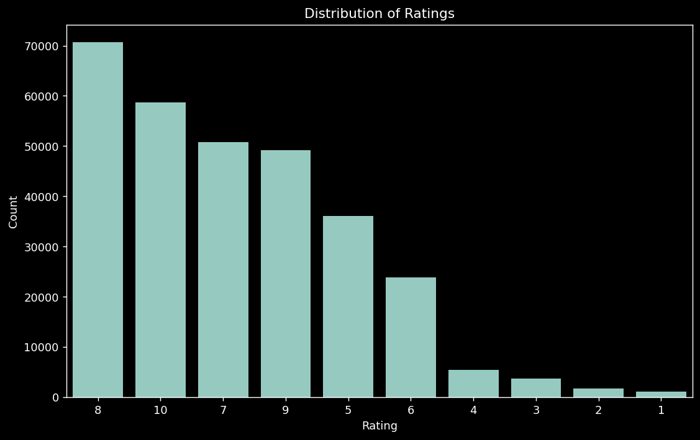
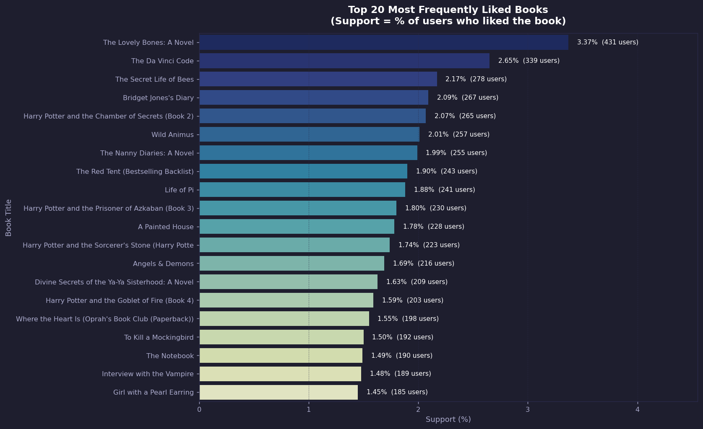
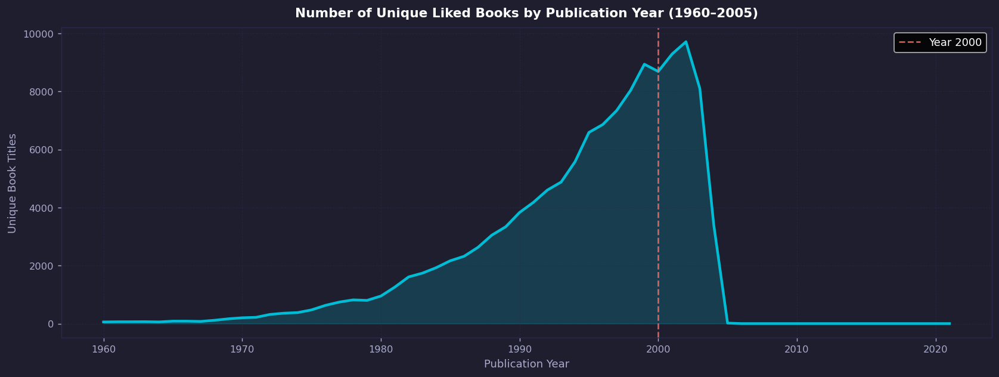

### Step 2: Frequent Itemset Mining — Apriori

I ran a sensitivity sweep across nine support thresholds to select an appropriate value. At 3% and above, only 1-itemsets survived — no associations were possible. At 0.5%, the algorithm produced a rich set of multi-item itemsets within under one second.

**Chosen threshold: min_support = 0.5%**

| Threshold | Total Itemsets | 2-item | 3-item | 4-item | Runtime |
|-----------|---------------|--------|--------|--------|---------|
| 0.5% | 428 | 128 | 32 | 6 | 0.537s |
| 0.7% | 328 | 46 | 14 | 6 | 0.472s |
| 1.0% | 289 | 17 | 8 | 2 | 0.450s |
| 1.5% | 167 | 7 | 1 | 0 | 0.183s |
| 3.0% | 31 | 0 | 0 | 0 | 0.009s |

**Apriori Results (min_support = 0.5%):**

| Metric | Value |
|--------|-------|
| Total frequent itemsets | 428 |
| 1-itemsets | 262 |
| 2-itemsets | 128 |
| 3-itemsets | 32 |
| 4-itemsets | 6 |
| Max support | 7.643% |
| Runtime | 0.537s |

The highest-support multi-item sets were Harry Potter book pairs (2.85% for Chamber of Secrets + Prisoner of Azkaban), confirming strong series co-reading. Cross-series pairs like *Da Vinci Code + Angels & Demons* (1.14%) revealed author loyalty patterns.

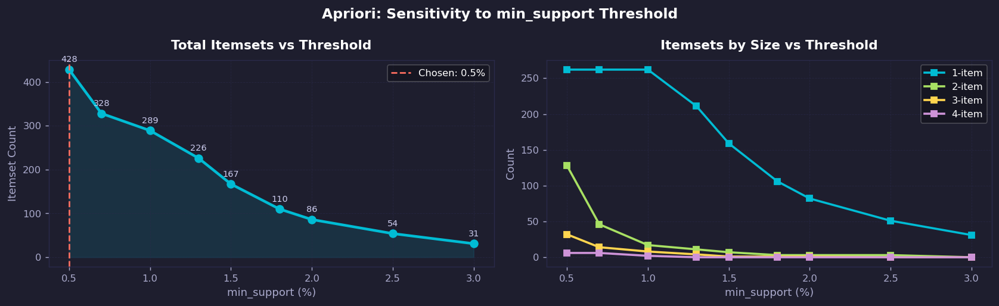

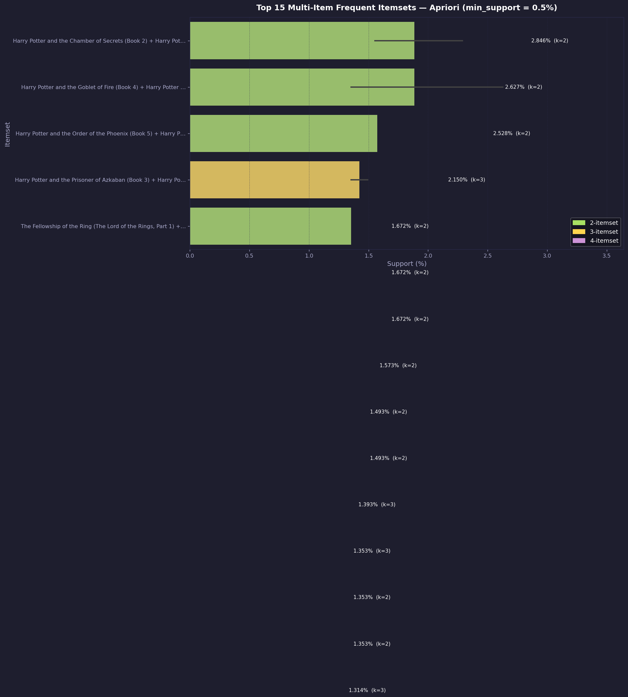
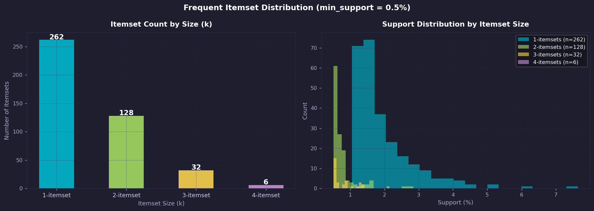

### Step 3: Frequent Itemset Mining — FP-Growth

FP-Growth was run at the same min_support = 0.5% threshold using the same basket.

**FP-Growth Results (min_support = 0.5%):**

| Metric | Value |
|--------|-------|
| Total frequent itemsets | 428 |
| 1-itemsets | 262 |
| 2-itemsets | 128 |
| 3-itemsets | 32 |
| 4-itemsets | 6 |
| Max support | 7.643% |
| Runtime | 2.089s |

Both algorithms produced **exactly the same 428 frequent itemsets** — confirmed by a set equality check (zero items unique to either algorithm).

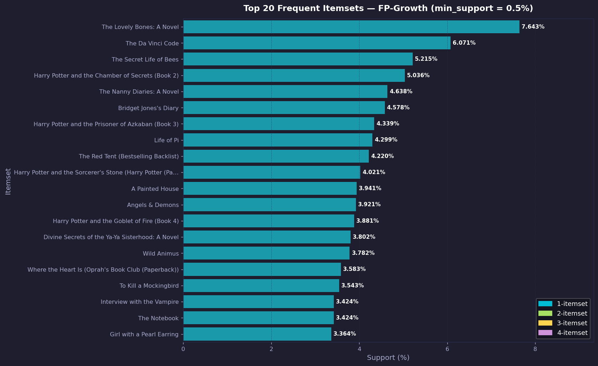
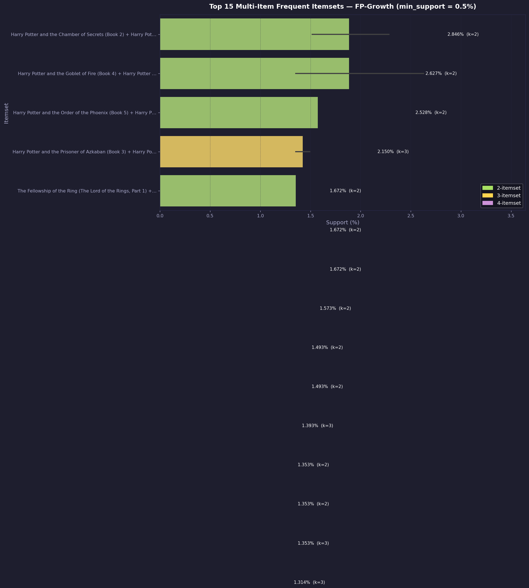
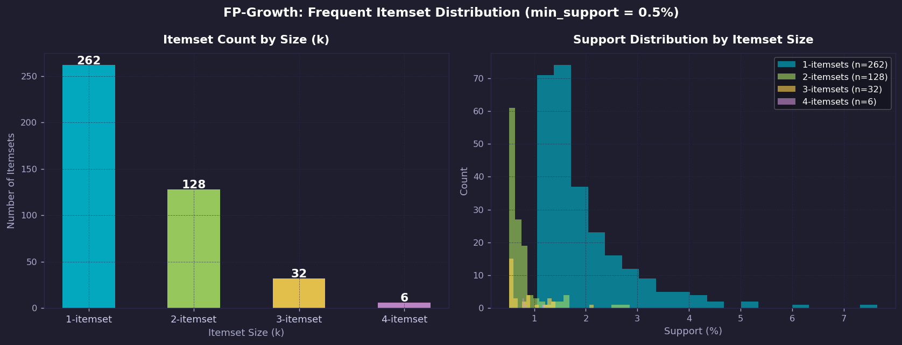

### Step 4: Association Rule Generation

Association rules were generated from both algorithm outputs using a confidence threshold sweep to choose the right cutoff.

**Chosen threshold: min_confidence = 0.5**  
At this threshold, 160 high-quality rules were produced — and crucially, all 160 rules had lift > 1, meaning every discovered association is genuinely stronger than random co-occurrence.

| Metric | Value |
|--------|-------|
| Total rules generated | 160 |
| Rules from Apriori | 160 |
| Rules from FP-Growth | 160 |
| Identical rule sets | ✓ |
| All rules with lift > 1 | ✓ |
| Average confidence | 0.700 |
| Average lift | 28.78 |
| Max lift | 54.68 |

The top rules by lift were dominated by within-series predictions (Stephanie Plum, Vampire Chronicles, Harry Potter), where knowing a user read several books in a series gave 70–91% confidence they also read an adjacent title. The exceptionally high average lift of ~29 means co-reading these book pairs is 29 times more likely than by random chance.

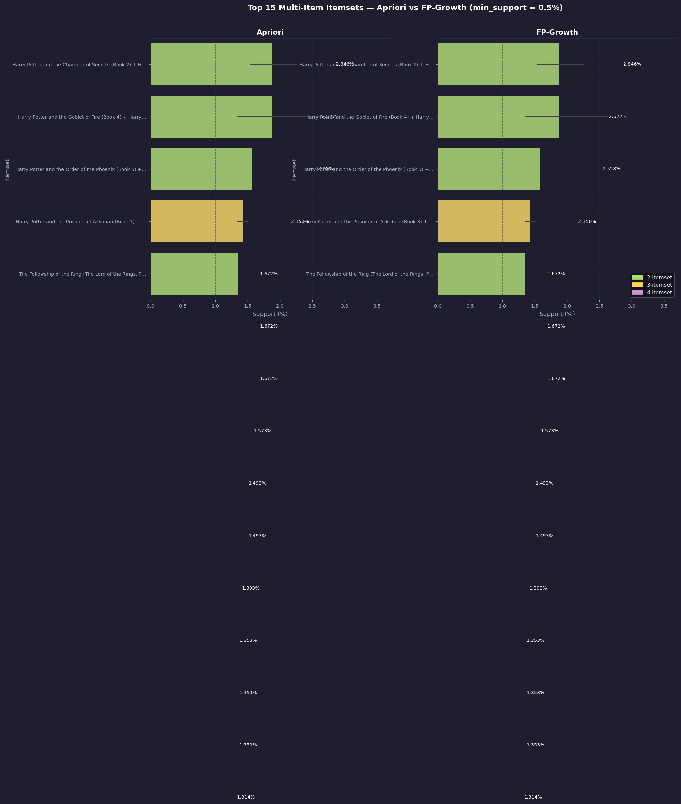
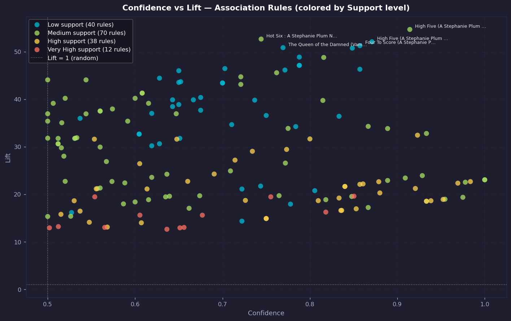
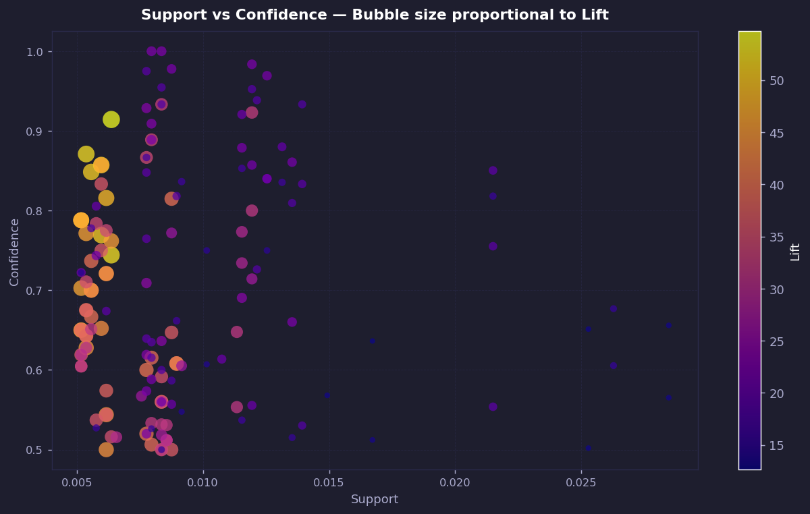
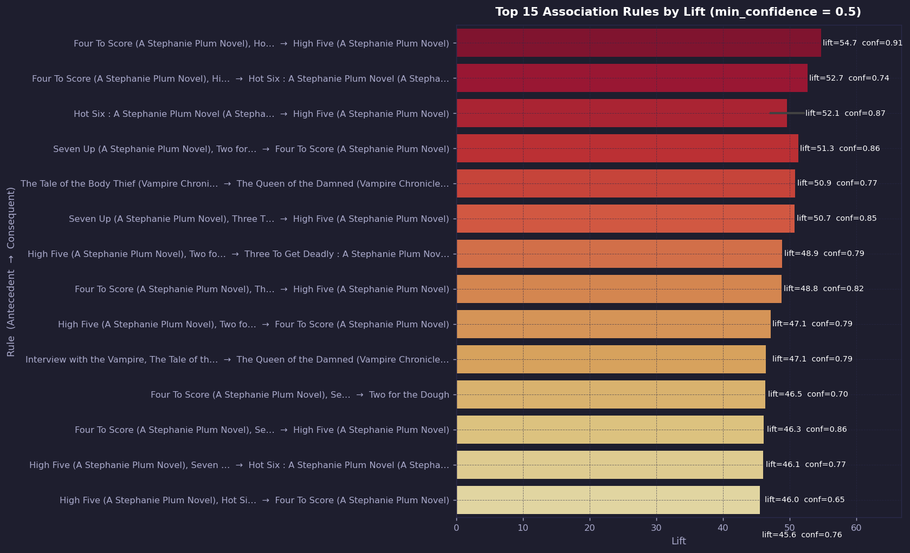
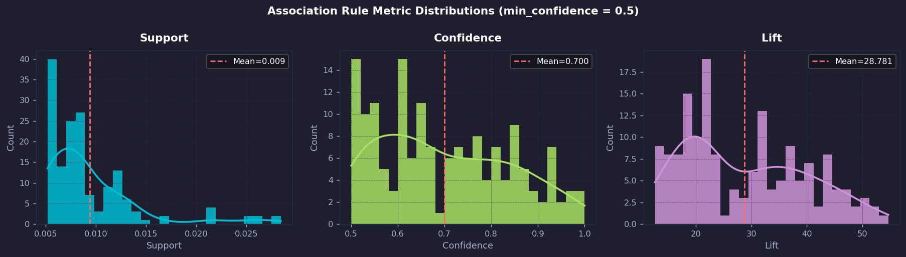
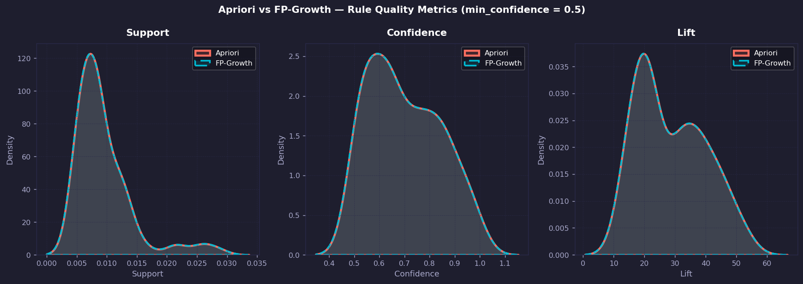

## Comparative Analysis — Apriori vs FP-Growth

### Algorithm Comparison

| Criterion | Apriori | FP-Growth |
|-----------|---------|-----------|
| Approach | Candidate generation + pruning | FP-Tree construction + recursive mining |
| Database scans | One per itemset level | Two total |
| Output | 428 itemsets, 160 rules | 428 itemsets, 160 rules |
| Runtime at 0.5% | 0.537s | 2.089s |
| Output identical | ✓ | ✓ |

### Which Algorithm Was Faster and Why

In this lab, **Apriori was faster than FP-Growth** at the chosen 0.5% threshold (0.537s vs 2.089s). This might seem counterintuitive since FP-Growth is generally considered the more efficient algorithm, but the result makes sense given how the data was structured:

- The pre-filtering step reduced the item space to only **262 eligible items**, making the basket matrix much smaller (5,024 × 262) and relatively dense at **1.954%**. Apriori's candidate generation overhead is low when the item space is this small.
- FP-Growth builds an FP-Tree in memory before mining, which adds construction overhead that only pays off when there are many candidates to prune. With 262 items, that overhead outweighed the savings.
- The runtime sweep across all thresholds confirmed this pattern — Apriori was consistently faster or comparable at lower support values, while FP-Growth only approached parity at higher thresholds where very few itemsets survived.

In a real-world scenario with thousands of eligible items and no pre-filtering, FP-Growth would be the clear winner because it avoids generating and testing enormous numbers of candidates.

### Challenges and How I Resolved Them

**1. Dataset size and memory constraints.**  
The raw basket matrix (12,787 users × 119,351 books) would have required over 1.5 GB of memory and was too large to one-hot encode directly. I resolved this by computing per-item support first, then pre-filtering to only the 262 items with at least 0.5% support — a valid optimization since no itemset can have higher support than its least frequent member.

**2. Extreme sparsity.**  
The full basket had 0.020% density — each user rated a tiny fraction of all books. This made standard apriori on the raw data impractical. The solution was combining pre-filtering with a user activity filter (≥ 5 books), which kept transactions meaningful while shrinking the space to 5,024 transactions and 262 items.

**3. Character encoding issues.**  
The CSV files used latin-1 encoding and contained special characters that caused failures with the default UTF-8 reader. I resolved this by explicitly passing `encoding='latin-1'` and `on_bad_lines='skip'` when loading the files.

**4. Selecting the right support threshold.**  
The dataset's extreme sparsity made this non-trivial. Too high a threshold left only 1-itemsets with no associations; too low a threshold was computationally expensive. The sensitivity sweep across nine thresholds (0.5% to 3.0%) revealed that 0.5% was the sweet spot — yielding 166 multi-item itemsets with a sub-second runtime.

## Key Insights

### How Well Each Algorithm Performed

Both Apriori and FP-Growth performed identically in terms of output quality — they produced exactly the same 428 frequent itemsets and 160 association rules with matching support, confidence, and lift values. The choice of algorithm is purely a performance decision for this dataset.

The generated rules were of exceptional quality. An average lift of 28.78 (with a max of 54.68) means these associations are far from random — they reflect real, strong co-reading behavior. A mean confidence of 0.70 means that on average, knowing a user read the antecedent books gives a 70% chance they also read the consequent.

### Insights Gained About the Book-Crossing Dataset

- **Series loyalty drives the strongest associations.** The highest-confidence and highest-lift rules all belong to book series — Harry Potter, Stephanie Plum, Vampire Chronicles, and Lord of the Rings. Readers who start a series almost always continue it.
- **Cross-series associations reveal author loyalty and genre affinity.** Rules like *The Da Vinci Code → Angels & Demons* (Dan Brown) and *Interview with the Vampire → The Vampire Lestat* show that readers follow authors and genres, not just specific books.
- **Implicit ratings are noise, not signal.** The 716,109 zero-rating records represented interactions without genuine preference. Dropping them and focusing on explicit ratings 1–10 was critical to extracting meaningful patterns.
- **Sparsity is both a challenge and a feature.** With 0.020% matrix density, most items never co-occur — which means the associations that do meet the threshold are genuinely meaningful rather than coincidental.
- **User filtering matters.** Removing users with fewer than 5 rated books eliminated single-item transactions that can never produce rules and also reduced noise from casual browsers who hadn't formed reading habits.
